# Cadence Workflow Linter - Design Documentation

## Table of Contents
1. [Project Overview](#project-overview)
2. [System Architecture](#system-architecture)
3. [Component Design](#component-design)
4. [Data Flow Diagrams](#data-flow-diagrams)
5. [Class/Interface Diagrams](#classinterface-diagrams)
6. [Sequence Diagrams](#sequence-diagrams)
7. [Configuration Design](#configuration-design)
8. [Detection Strategy](#detection-strategy)

## Project Overview

### Purpose
The Cadence Workflow Linter is a static analysis tool designed to identify non-deterministic or unsafe operations in Uber Cadence workflows. It ensures workflow code remains deterministic, reliable, and production-safe while avoiding false positives in activity code.

### Key Goals
- **Determinism**: Ensure workflows are deterministic and replay-safe
- **Extensibility**: Support for adding new detection rules without core changes
- **Accuracy**: Distinguish between workflow and activity code to avoid false positives
- **Configurability**: Rule-based configuration through YAML files

## System Architecture

### High-Level Architecture Diagram

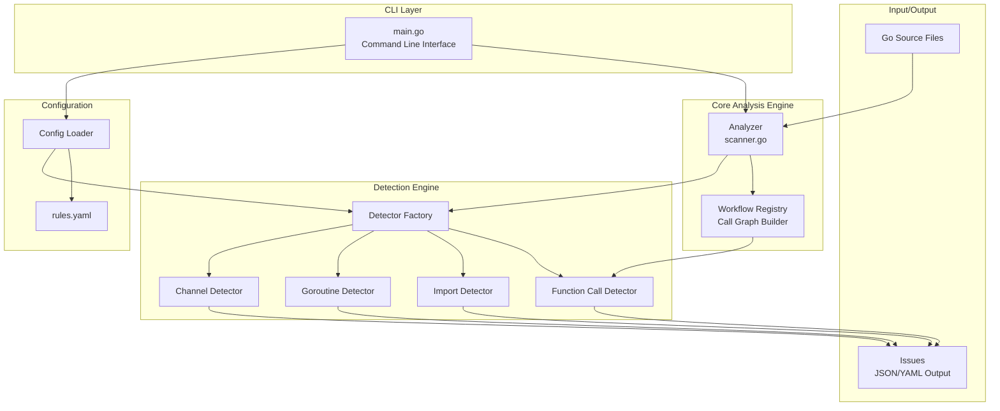

### Architectural Layers

1. **CLI Layer**: Entry point handling command-line arguments and output formatting
2. **Analysis Engine**: Core scanning and registry management
3. **Detection Engine**: Pluggable detectors for different violation types
4. **Configuration Layer**: YAML-based rule configuration
5. **I/O Layer**: File parsing and issue reporting

## Component Design

### 1. Main Components Overview

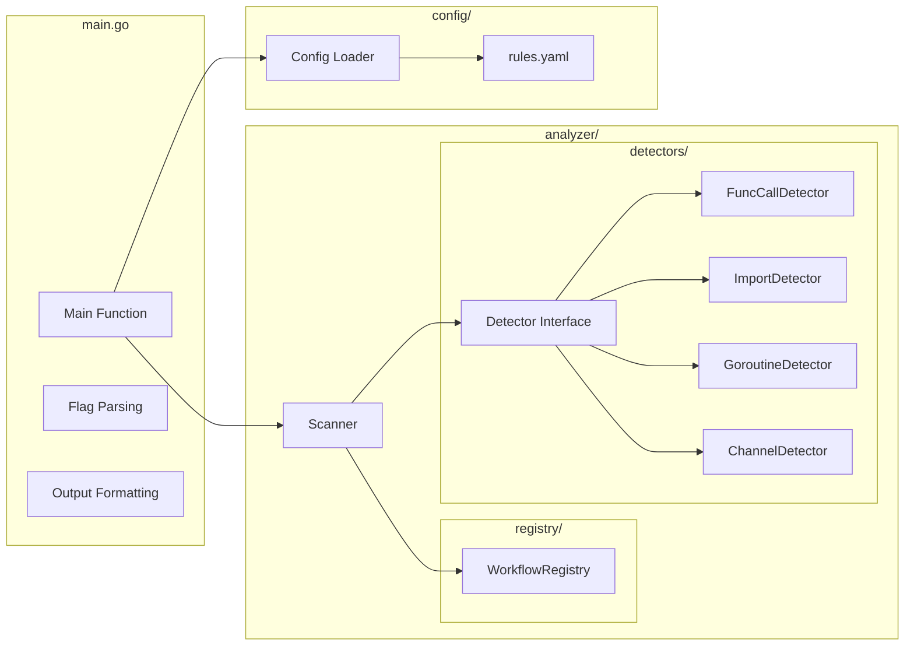

### 2. Detector Interface Design

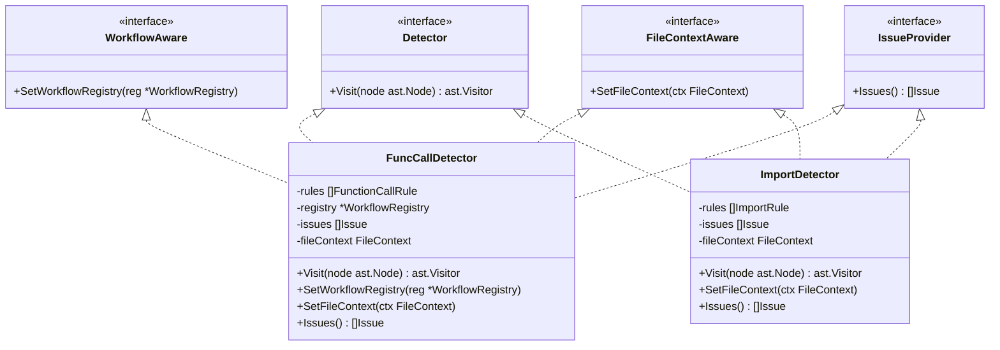

## Data Flow Diagrams

### 1. Overall Analysis Flow

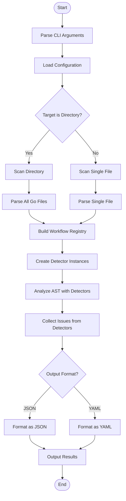

### 2. Workflow Registry Building Process

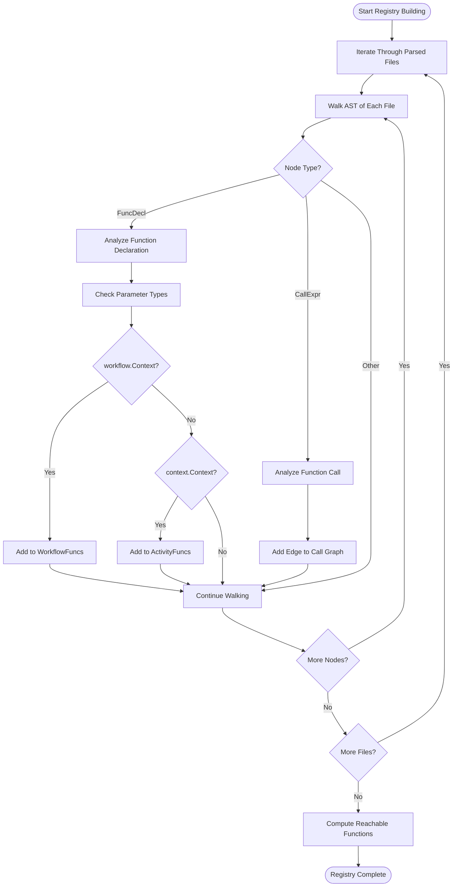

### 3. Detection Process Flow

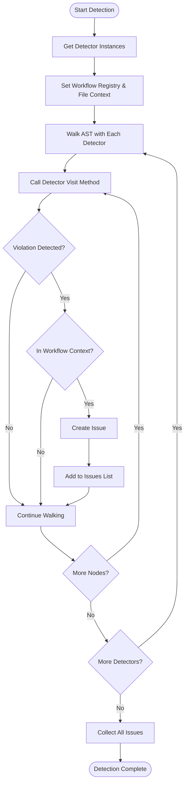

## Class/Interface Diagrams

### 1. Core Interfaces and Structures

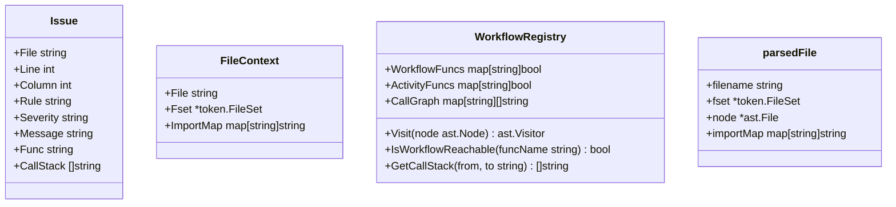

### 2. Configuration Structure

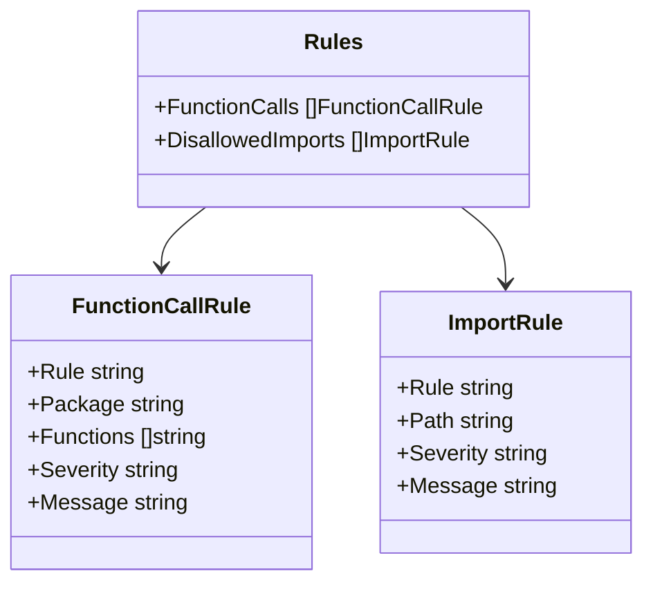

## Sequence Diagrams

### 1. Main Execution Sequence

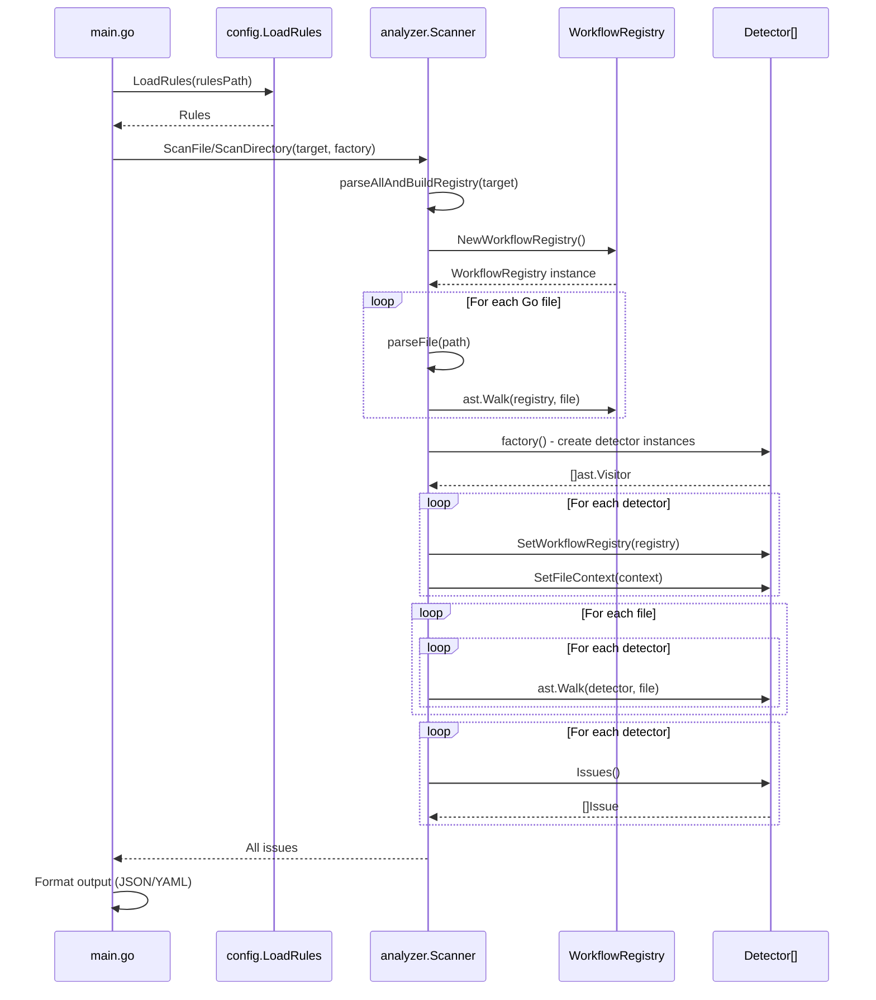

### 2. Detector Execution Sequence

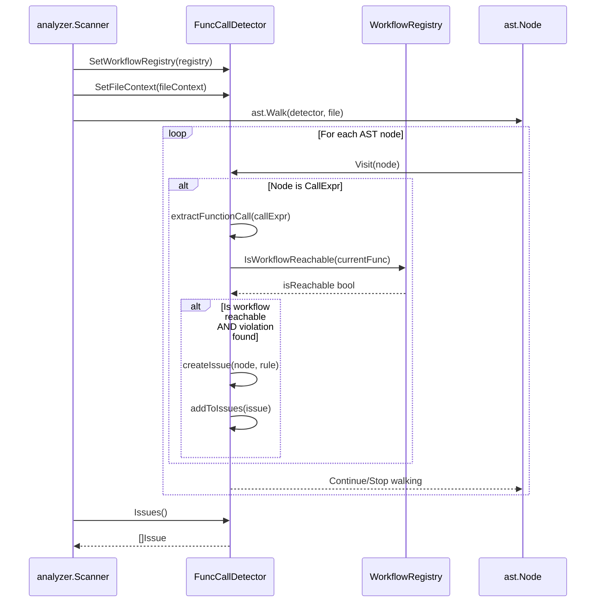

## Configuration Design

### 1. Rules Configuration Structure

The configuration system uses YAML to define linting rules:

```yaml
# Function call rules
function_calls:
  - rule: TimeUsage
    package: time
    functions: [Now, Since, Sleep]
    severity: error
    message: "Detected time.%FUNC%() in workflow. Use workflow.Now(ctx)/workflow.Sleep(ctx) instead."

# Import rules
disallowed_imports:
  - rule: ImportRandom
    path: math/rand
    severity: warning
    message: "Importing math/rand in files with workflows is discouraged"
```

### 2. Configuration Loading Flow

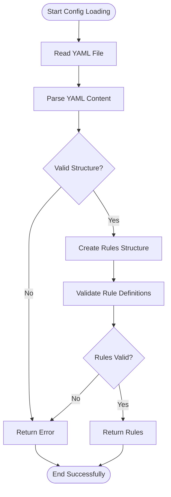

## Detection Strategy

### 1. Workflow Context Detection

The linter uses a sophisticated approach to determine if code is executing in a workflow context:

1. **Function Signature Analysis**: Identifies functions with `workflow.Context` as workflow functions
2. **Call Graph Construction**: Builds a graph of function calls to track reachability
3. **Reachability Analysis**: Determines if a function is reachable from a workflow function

### 2. False Positive Avoidance

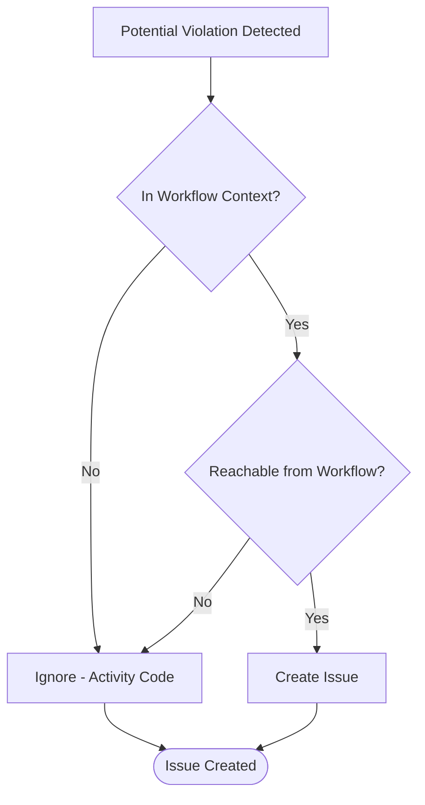

### 3. Multi-File Analysis

The linter performs two-pass analysis:

1. **Pass 1**: Parse all files and build the global workflow registry
2. **Pass 2**: Run detectors with full context of the entire codebase

This approach ensures accurate detection across file boundaries and proper handling of helper functions defined in separate files.

## Hybrid Package Classification System

### Overview

The linter uses a hybrid approach combining go.mod parsing with enhanced heuristics to accurately classify packages as internal or external. This system provides robust package classification while maintaining compatibility with projects that don't follow standard module structures.

### Implementation Strategy

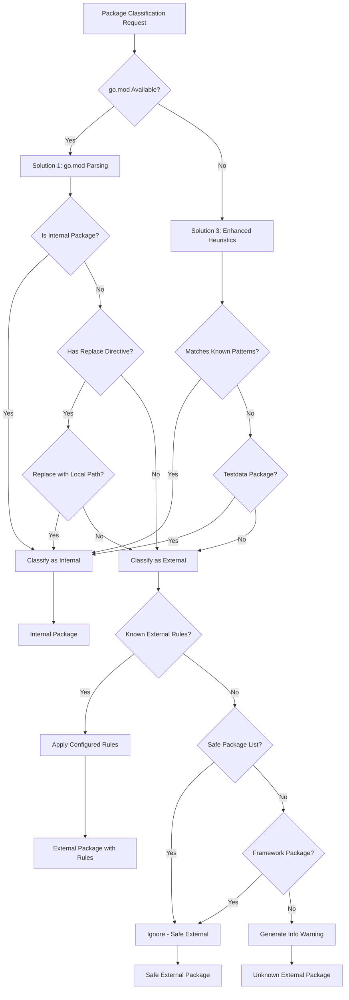

### Key Components

#### 1. ModuleInfo Parser

```go
type ModuleInfo struct {
    ModulePath  string            // The module declaration path
    GoVersion   string            // Go version requirement  
    Requires    []RequireDirective // Direct dependencies
    Replaces    []ReplaceDirective // Replace directives
    RootDir     string            // Directory containing go.mod
}
```

**Features:**
- Parses module path, go version, require and replace directives
- Handles both single-line and block syntax
- Supports indirect dependency detection
- Processes local path replacements

#### 2. Package Resolver

```go
type PackageResolver struct {
    moduleInfo *modutils.ModuleInfo
    baseDir    string
}
```

**Hybrid Classification Logic:**
1. **Primary**: Use go.mod information when available
2. **Fallback**: Enhanced heuristics for compatibility
3. **Special Cases**: Handle testdata and replaced packages

#### 3. External Package Detection

The `FuncCallDetector` integrates the hybrid approach:

```go
func (d *FuncCallDetector) isInternalPackage(importPath string) bool {
    // Solution 1: Use go.mod information if available
    if d.moduleInfo != nil {
        if d.moduleInfo.IsInternalPackage(importPath) {
            return true
        }
        
        // Check replace directives for local paths
        if isReplaced, newPath := d.moduleInfo.IsReplacedPackage(importPath); isReplaced {
            if isLocalPath(newPath) {
                return true
            }
        }
    }
    
    // Solution 3: Enhanced heuristics as fallback
    return d.isInternalByHeuristics(importPath)
}
```

### Benefits

1. **Accuracy**: go.mod parsing provides authoritative module information
2. **Compatibility**: Fallback heuristics work without go.mod
3. **Flexibility**: Handles replace directives and local development
4. **Maintainability**: Reduces hardcoded assumptions

### Detection Tiers

The hybrid system provides four-tier external package coverage:

1. **Known Bad Packages** → Error (configured rules)
2. **Known Safe Packages** → Ignored (safe list)  
3. **Unknown External Packages** → Info Warning (user verification)
4. **Framework Packages** → Ignored (Cadence, stdlib)

---

This design documentation provides a comprehensive overview of the Cadence Workflow Linter's architecture, components, and design decisions. The modular design allows for easy extension with new detectors while maintaining accuracy through sophisticated workflow context analysis and hybrid package classification.