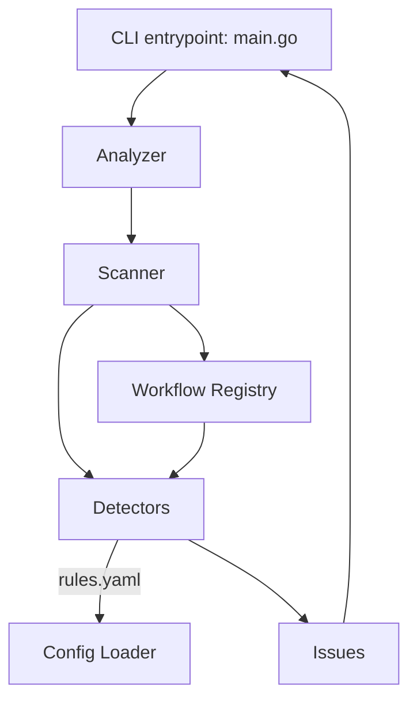
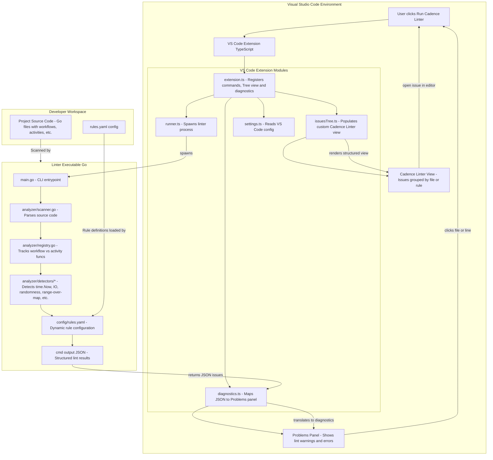

```mermaid
flowchart TD
    A[CLI entrypoint: main.go] --> B[Analyzer]
    B --> C[Scanner]
    C --> D[Workflow Registry]
    C --> E[Detectors]
    E -->|rules.yaml| F[Config Loader]

    D --> E
    E --> G[Issues]
    G --> A
```

```mermaid
flowchart TD
    subgraph VSCode["Visual Studio Code Environment"]
        A[User clicks Run Cadence Linter] --> B[VS Code Extension TypeScript]
        subgraph EXT["VS Code Extension Modules"]
            B1[extension.ts - Registers commands, Tree view and diagnostics]
            B2[runner.ts - Spawns linter process]
            B3[diagnostics.ts - Maps JSON to Problems panel]
            B4[issuesTree.ts - Populates custom Cadence Linter view]
            B5[settings.ts - Reads VS Code config]
        end
        B --> B1
        B1 --> B2
        B1 --> B3
        B1 --> B4
        B1 --> B5

        B3 --> C1[Problems Panel - Shows lint warnings and errors]
        B4 --> C2[Cadence Linter View - Issues grouped by file or rule]
    end

    subgraph CLI["Linter Executable Go"]
        D1[main.go - CLI entrypoint]
        D2[analyzer/scanner.go - Parses source code]
        D3[analyzer/registry.go - Tracks workflow vs activity funcs]
        D4[analyzer/detectors/* - Detects time.Now, IO, randomness, range-over-map, etc.]
        D5[config/rules.yaml - Dynamic rule configuration]
        D6[cmd output JSON - Structured lint results]
        D1 --> D2 --> D3 --> D4 --> D5 --> D6
    end

    subgraph USER["Developer Workspace"]
        E1[Project Source Code - Go files with workflows, activities, etc.]
        E2[rules.yaml config]
    end

    E1 -->|Scanned by| CLI
    E2 -->|Rule definitions loaded by| D5

    B2 -->|spawns| D1
    D6 -->|returns JSON issues| B3
    B3 -->|translates to diagnostics| C1
    B4 -->|renders structured view| C2

    C1 -->|clicks file or line| A
    C2 -->|open issue in editor| A
```
