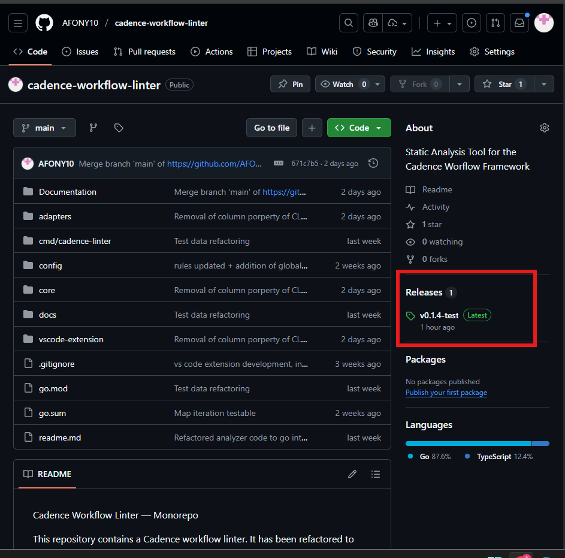
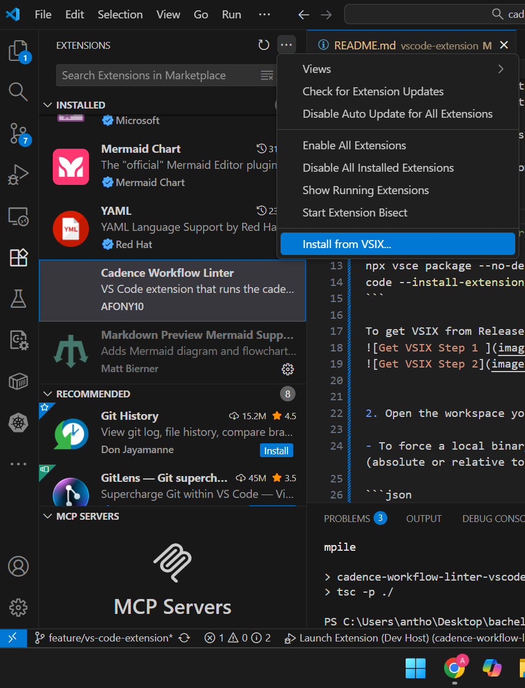

# Cadence Workflow Linter — VS Code Extension

## About
  The Cadence Workflow Linter extension runs the `cadence-workflow-linter` CLI and surfaces issues as VS Code Problems/Diagnostics. The extension is small and ships without binaries: it will prefer a configured CLI binary, then a workspace or PATH binary, and — if none are found — will auto-download the correct platform binary from the repository's GitHub Release.

## Features

  - Problems panel diagnostics for linter findings
  - Output channel with discovery, download, checksum and run logs
  - Hover support for reported issues
  - Commands: run linter and check/download CLI updates

## Get it from GitHub (quick)

  1. Open this repository's Releases page (see the annotated screenshots below).
  2. Download the `.vsix` asset for the release you want to test.
  3. In VS Code → Extensions view → menu (...) → "Install from VSIX..." → select the downloaded file.

  Or build locally (optional):

  ```powershell
  cd vscode-extension
  npx vsce package --no-dependencies
  # produces a cadence-workflow-linter-vscode-<version>.vsix file
  ```

## How to use

  - Logs: View → Output → select "Cadence Workflow Linter" to see discovery, download and run logs.
  - Problems: View → Problems shows all reported issues from the linter.
  - Run on save: toggle `cadenceLinter.runOnSave` (default: true) to run the linter automatically when saving files.
  - Commands (Command Palette):
    - "Cadence Workflow Linter: Run" — run the linter immediately
    - "Cadence Workflow Linter: Check for CLI update" — fetch the release manifest and attempt to download the platform-specific CLI
      - "Cadence Workflow Linter: Export SARIF" — run the linter and save results in SARIF format (for CI/Code Scanning)


## Annotated screenshots (on how to get the extenstion)

### 1) Open the Release

- Open the GitHub repository Releases page and click the latest release you want to test.

### 2) Download the VSIX from Assets

- In the Release's Assets section, download the `.vsix` file (the packaged extension) to your machine.

### 3) Install from VSIX in VS Code

- In VS Code Extensions view, select the menu (⋯) and choose "Install from VSIX...", then pick the downloaded file.

### 4) Reload & verify

- After installation, reload the window if prompted. Open the Output panel and select "Cadence Workflow Linter" to see activation logs.
