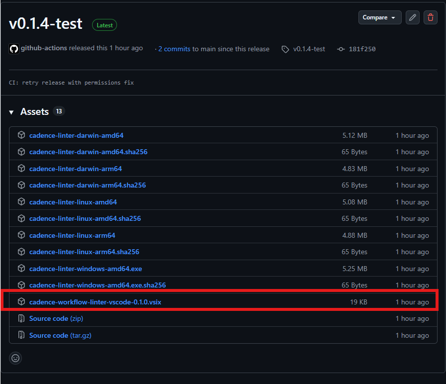
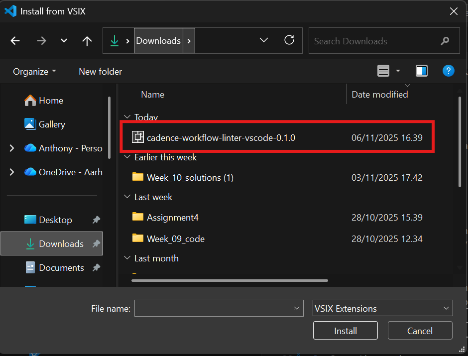

Cadence Workflow Linter — VS Code Extension

This VS Code extension runs the `cadence-workflow-linter` CLI and surfaces issues as Problems/Diagnostics. It will either use a configured CLI, a workspace-local binary, or (if none found) automatically download the correct prebuilt binary from GitHub Releases.

Quick start (for testers)

1. Install the VSIX (from a Release in GitHub or built locally)

To build locally:
```powershell
# from repository folder
cd vscode-extension
npx vsce package --no-dependencies    # produces a .vsix
code --install-extension ./cadence-workflow-linter-vscode-*.vsix
```

To get VSIX from Release in GitHub: 






2. Open the workspace you want to test and verify settings

- Optional: To force a local binary, create `.vscode/settings.json` and set `cadenceLinter.cliPath` (absolute or relative to the workspace root):

```json
{
  "cadenceLinter.cliPath": "./bin/cadence-linter.exe",
  "cadenceLinter.runOnSave": true,
  "cadenceLinter.args": ["--format","json"]
}
```

- To exercise the auto-download path, remove `cadenceLinter.cliPath` from settings and ensure you have network access; the extension will download the correct binary from Releases and store it in its global storage.

3. Watch the Output panel

Open View → Output and select "Cadence Workflow Linter" to see discovery, download, and run logs. The extension always injects an absolute `--rules <path>` to avoid missing-rules errors.

Development & debugging

- Install dependencies and compile the extension runtime

```powershell
cd vscode-extension
npm ci
npm run compile
```

- Run in the Extension Development Host (press F5 in VS Code).

Configuration

- `cadenceLinter.cliPath` (string): optional absolute or workspace-relative path to a CLI binary. If set and valid the extension will use it and skip downloading.
- `cadenceLinter.runOnSave` (boolean): run on save (default: true).
- `cadenceLinter.args` (string[]): extra CLI arguments to pass.

Notes for testers

- The extension will attempt to download platform-specific binaries from the GitHub Release attached to the same repository. For auto-download to work the Release must contain assets named exactly as listed in `resources/releases.json` (e.g. `cadence-linter-windows-amd64.exe`).
- The extension will store downloaded binaries in extension global storage and re-use them between sessions.
- For extra safety we recommend verifying checksums (the CI workflow produces `.sha256` files next to each binary). The extension will be updated to verify checksums automatically in a follow-up.

Troubleshooting

- If you see `Configured CLI path set but not found`, check `.vscode/settings.json` and either correct the path or remove the setting to let the extension discover/download a binary.
- If download fails, check the Output panel for the exact download URL and try opening it in a browser to see HTTP status or errors.

Contact / Feedback

Open an issue in this repository if you run into problems while testing.
